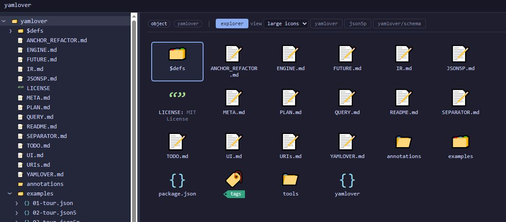
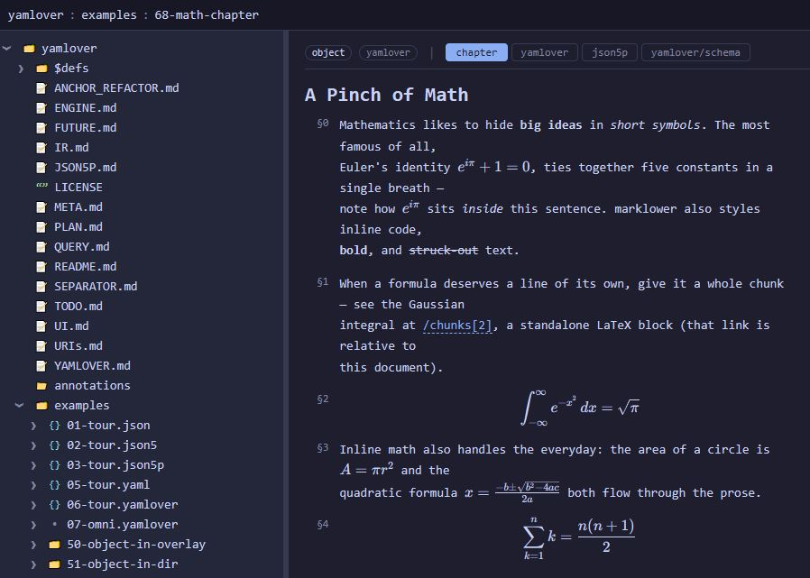

# yamlover

`yamlover` is a materialization "language", closely related to `YAML` and `JSON`
(but a distinct language, not a strict superset of YAML), that supports both file
and filesystem storage of tree- and graph-like data structures (directed graphs,
cycles allowed).

**yamlover** stands for **YAML Overlay** — not "Yam lover". It means YAML layer
laid *over* the filesystem.

> **▶ Try it live:** [**yamlover.inthemoon.net**](https://yamlover.inthemoon.net/) —
> get a private, disposable instance (pre-loaded with these `examples/`) by email.
> No install.





The project has the following goals

- define a way to store JSON-like data structures in a filesystem trees
- be able to describe directory content by a metadata schema (typing, formats,
  presentation; validation optional)
- extend the YAML/JSON family with first-class **pointers** (graph edges)
- support not only trees, but directed (oriented) graphs in general — cycles (loops)
  allowed, not just DAGs
- support mind mapping storage
- support metadata and tagging software
- support control of LLM agents
- support reference management for scientific paper research
- define a way to navigate JSONs and YAMLs in cd/ls manner

> **Status:** specs + a working implementation of the read side.
> [`URIs.md`](URIs.md) (pointer model), [`QUERY.md`](QUERY.md) (query language —
> pointers are its singleton fragment), [`JSON5P.md`](JSON5P.md) /
> [`YAMLOVER.md`](YAMLOVER.md) (the two surface languages), [`IR.md`](IR.md)
> (instance-graph contract), [`META.md`](META.md) (metadata schema),
> [`CHAPTER.md`](CHAPTER.md) / [`MARKLOWER.md`](MARKLOWER.md) (the document model
> and the inline markup its prose is written in),
> [`ENGINE.md`](ENGINE.md) / [`FUTURE.md`](FUTURE.md) (core design),
> [`PLAN.md`](PLAN.md) (build plan, kept current). Implemented in
> [`tools/`](tools/): [`parser`](tools/parser/) (hand-written json5p + yamlover
> parsers → IR, conformance-gated against the JSON / JSON5 / YAML test suites),
> [`engine`](tools/engine/) (SQLite property-graph store, directory walker,
> pointer resolver), [`server`](tools/server/) (`npx yamlover <root>` — browse
> **and edit** a tree in the web, backed by the engine; see [`UI.md`](UI.md) for
> navigation, views, pan/zoom, annotations, paste/drag-and-drop upload), and a
> [JetBrains plugin](tools/jetbrains-plugin/) (filetypes + highlighting).
> The write side is running: serializers for the text concretes (IR → yamlover /
> json5p, round-trip-gated), the surgical `/api/edit` editor (comment-preserving
> source splices), paste/upload, `mv` with surgical inbound-pointer rewriting,
> the FS watcher with three-tier reconcile, background indexing/tasks with
> server-side thumbnails, and SSE live refresh are implemented.
> The **query evaluator** is live too (colon-grammar match templates per
> [`SEPARATOR.md`](SEPARATOR.md), evaluated over the index, `GET /api/query`).
> Still missing: the *directory* serializer, inline-binary emission, and
> `rm`/`put`/`normalize`. The Python `walker`/`collector` are deprecated
> (see [`tools/LEGACY.md`](tools/LEGACY.md)).

## Isomorphisms briefly

### YAML vs JSON

YAML is a superset of JSON, denoting principally the same data structure.

### directory vs YAML or JSON

Directory is a dictionary of BLOBs.

### document vs graph

A `*` pointer turns a copied subtree into a **shared edge** — the same node
reached from several places. Trees are the degenerate, pointer-free case.

## Concrete representations — a supersession lattice

A node of the graph, and the structure around it, can be rendered in any of the
following concretes. They are **not** isomorphic — the JSON family forms a
supersession lattice (serializing a graph *down* it is lossy); yamlover is a
*separate* YAML-like language rather than a superset of yaml:

```
json ⊂ json5 ⊂ json5p          yaml ~ yamlover   (close kin, not ⊂)
```

The per-node storage taxonomy these surface into (inlined vs `file/…` vs
directory vs multi-document) is specified in **`CONCRETES.md`**.

1. **json** — strict JSON; tree-only (a shared node becomes a copy).
2. **json5** — JSON plus comments, unquoted keys, trailing commas, …; still tree-only.
3. **json5p** — JSON5 **plus pointers**: `*` deref, `&` anchors, `~` back-edges,
   scopes. A full-graph concrete. (See `JSON5P.md`.)
4. **yaml** — plain YAML; native `&`/`*` anchors are its sharing ceiling.
5. **yamlover** — a distinct, YAML-like language (not a superset of yaml) carrying
   the pointer layer: extended `*` paths, `&`, `~`, `[n]`/`/x` addressing, links.
   A full-graph concrete; it can switch to json5p, never to pure yaml. (See
   `YAMLOVER.md`.)
6. **dir** — a regular filesystem directory: filenames are keys, files are blobs
   or nested documents.
7. **dir + `.yamlover/` overlays** — a directory whose hidden `.yamlover/`
   subdirectory overlays it with instance data and/or metadata (next section); a
   full-graph concrete, and the one that makes a directory "speak YAML".

`examples/` walks the lattice over one dataset: `01-tour.json` →
`02-tour.json5` → `03-tour.json5p` and `05-tour.yaml` → `06-tour.yamlover`.

## The `.yamlover/` overlays

A directory's hidden `.yamlover/` holds up to two complementary overlays, plus
engine state (see `META.md` for the full contract):

- **`body.yamlover`** — the **instance** overlay: data values laid over the
  directory (scalars, mappings, pointers, ordering). A pointer-array body
  (`- *file1 …`) assigns the directory's element order — disk has none.
- **`meta.yamlover`** — the **metadata schema**: a JSON-Schema-equivalent
  written in yamlover (`properties`, `type`, `format`, `prefixItems`, …) whose
  primary job is typing / decoding / presentation, with validation optional.
- in the **project root** only, **`settings.yamlover`** — project
  configuration (defaults such as where new annotations are created).

Either overlay is optional: a plain directory has neither and its files simply
*are* the data; `examples/50-object-in-overlay` has only a `body`;
`examples/55-scalar-as-binary` has only a `meta` (the data is the on-disk file,
the meta says how to read its bytes).

What was **dropped** from earlier designs is *schema-as-storage* — the old
`.yamlover/schema.yaml` whose `const:`-pinned leaves doubled as the data. The
schema↔instance correspondence that motivated it still holds conceptually, but
data now lives only in the instance (files and/or `body.yamlover`); the schema
only describes it (`META.md`).

## The core idea

There is one data model — an ordered graph whose nodes are mappings, scalars,
and blobs, connected by **containment** and **reference** edges — with the
concretes above as equivalent-up-to-the-lattice renderings. The two big
families are the **filesystem** view and the **document** view:

- **A node (mapping)** → a directory / a yamlover or json5p file.
- **A child with a structured value** → a subdirectory or file / a nested key.
- **A child with a scalar value** → a small file, or an entry in
  `body.yamlover` / a scalar key.
- **A shared or cross-referencing child** → a `*` pointer (and optionally its
  `~` reverse), in any full-graph concrete.

A directory can be *collapsed* into a single file, and a file *expanded* into a
directory, without changing what the data means. `examples/51-object-in-dir`,
`50-object-in-overlay`, and the tour files draw this triangle over one datum.

## Equivalence rules

1. **A directory is a mapping.** Its children are the keys; files supply string
   keys (filenames), the `body.yamlover` pointer-array supplies integer-key
   positions when order matters.
2. **A file is equivalent to a subdirectory** — both represent the same node. A
   structured child may be stored either as `child.yamlover` (collapsed) or as
   `child/` (expanded). Tools may convert freely between the two.
3. **The `.yamlover/` directory is the overlay marker.** Its presence promotes
   a plain *dir* into a node with instance/metadata overlays.
4. **One ordered container.** There is no separate list/dict: a mapping is
   ordered and its positions are integer keys (`[n]`); `/x` addresses a string
   key. Order is data — text order in a file, the pointer-array for a directory.
5. **Pointers are edges, not copies.** `*` dereferences a path
   (`*../../pets[1]`, `*/people/alice`), `&` declares an anchor, `~key:` authors
   a back-edge. One reference mechanism across every concrete (`URIs.md`).

## Partial flattening

Collapse/expand (above) trades *storage* shapes without changing the data.
**Partial flattening** is the *presentation* analogue: a view may render a deeper
subtree shallowly, pulling some descendants up to become constituent parts of
*this* level instead of separate places you navigate away to. The data and its
paths are unchanged — only how a renderer lays them out.

The first instance is the **chapter** renderer (the `$defs/chapter` schema — a
fully omni node whose scalar self-value is the **title**, with an optional keyed
`description` and a **positional body** of chunks
and subchapters, `CHAPTER.md`): a chapter's chunks are flattened into one readable
page (each chunk rendered inline by the renderer for its own type — prose chunks
by marklower, which inlines images, video, and audio where the author wrote an
`*[…](…)` embed, `MARKLOWER.md`), rather than being browsed one node at a time. (Its subchapters — body elements that are
themselves chapters — are *not* flattened; they stay links you navigate to. A
future option will flatten further levels.)

Flattening must not cost a node its address. The rule:

> A flattened child still exposes its location, as a **fragment anchor** whose
> syntax is the **path continuation** that reaches it — and the full path keeps
> working as ordinary navigation.

So a chapter at `:book` whose first body chunk lives at the still-navigable path
`:book[1]` exposes that chunk, on the flattened page, as the anchor `#[1]`: opening
`:book#[1]` scrolls straight to it. The fragment is spelled exactly like the path
suffix (`[1]`), so the two notations agree — `:book[1]` navigates *to* the chunk's
own node; `:book#[1]` locates the *same* chunk where it was flattened in. Deeper
flattening simply yields longer continuations (e.g. `#[3][2]` for a chunk inside a
subchapter).

A rendered prose document has the same need at a finer grain. A `.md`/`.adoc` file
is one HTML blob, so its **headings** would otherwise have no address. The `markdown`
and `asciidoc` renderers therefore give every heading an `id` and a small `§` link
to it (the way GitHub renders the same documents), so a section is reachable as
`<page>#<slug>` — the prose-document counterpart of the chapter's `§N` chunk
anchors. Asciidoctor's own section ids are kept, so the anchors line up with the
document's internal cross-references.

## Metadata, formats, rendering

`meta.yamlover` (or an inline `!!<…>` tag in a yamlover file) gives a node its
`(type, format)`; the web viewer's renderer registry keys on that tuple. Format
resolution order: the meta `format:` if present; else a recognized file
extension (`.png`→`image/png`, `.md`→`text/markdown`, `.yamlover`→`yamlover`,
…); else sniff — see `META.md`. A chapter's prose chunks carry `text/marklower`
(`MARKLOWER.md`) by schema propagation; a string with no format at all is data,
and shows in the data view. `type: binary` plus a codec format
(`int32/le`) decodes raw bytes (`examples/55-scalar-as-binary`);
`prefixItems` orders and types an array whose elements live in arbitrary files
(`examples/56-array-of-files`); a `format` like `text/x-latex` or a per-chunk
`!!<…>` tag picks a renderer (`examples/65`/`66`/`68`).

References inside a schema use the same `*` pointers as instances (reusable
fragments under `$defs`, e.g. `*yamlover/$defs/chapter`) — **not** JSON
Schema's `$ref`/JSON-Pointer dialect, so there is one reference mechanism
everywhere.

## Open questions

- **Serializers / write-back** — the text concretes are built (IR → yamlover /
  json5p, reparse-IR-equal; lossy targets refuse rather than drop). Still open:
  the *directory* concrete (graph → tree + `body.yamlover`), inline-binary
  emission, and per-node concrete tracking for mid-tree style switches
  (`PLAN.md` 2d remaining); they gate `put` / `normalize`.
- **Meta authoring shape** — the exact keyword set and reuse/cross-ref story of
  the metadata schema is provisional (`META.md` §Status).
- **Free node moves** — moving a node anywhere in the graph with inbound
  pointers rewritten (`ENGINE.md`); planned, with per-feature defaults (e.g.
  the last location an annotation was moved to) remembered in settings.
