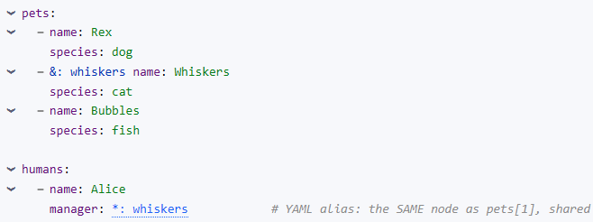
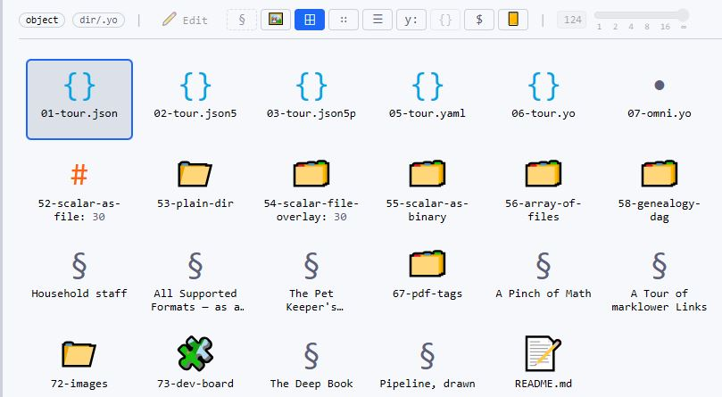
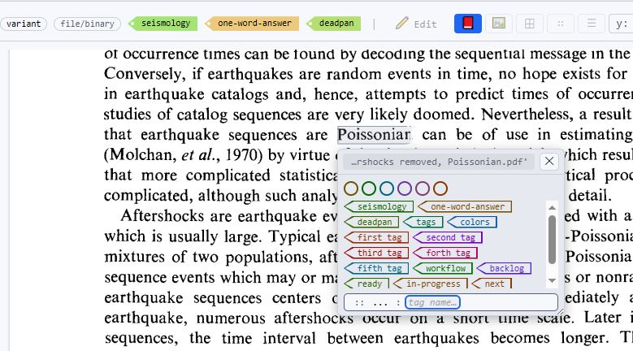
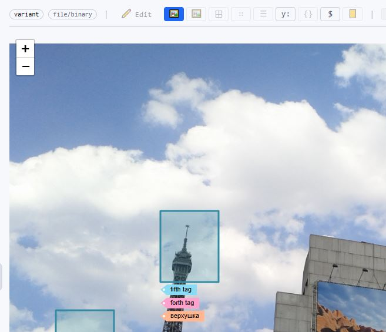
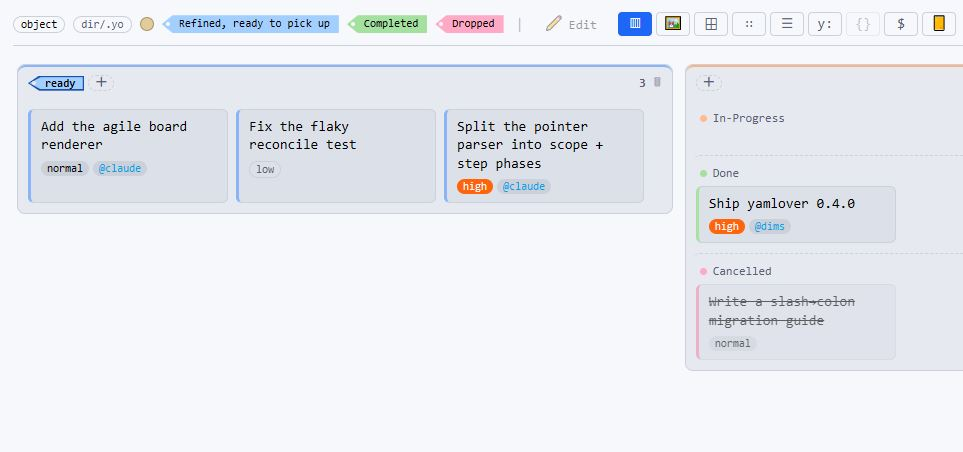
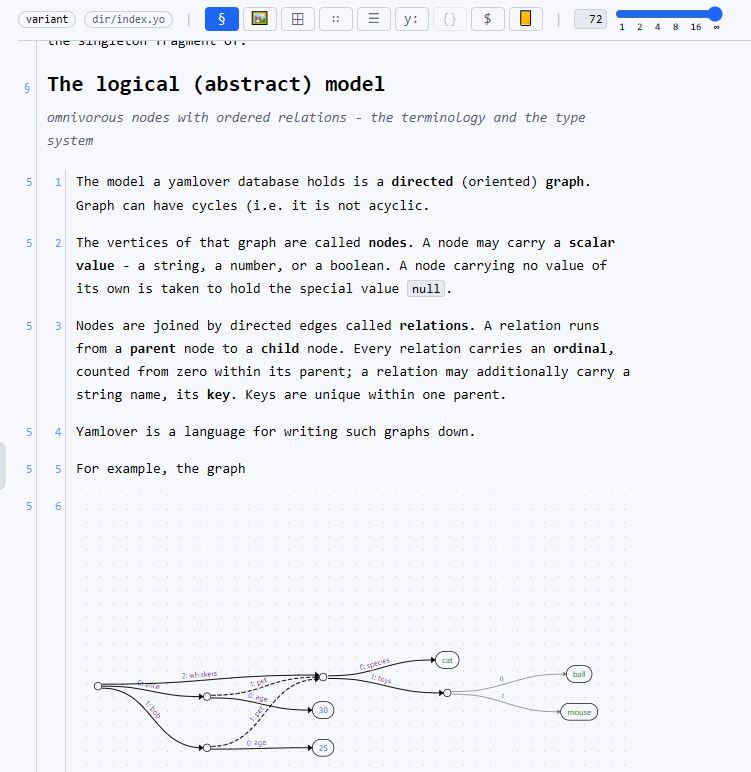

# yamlover

## A shared memory for humans, tools and LLMs

**yamlover** is a platform for knowledge that people and machines can hold
*together*: one plain-text, local-first, human-readable graph that you edit like
notes, an agent reads like a database, and `git` versions like code.

You can [read the full documentation](https://yamlover.inthemoon.net/docs?utm_source=github&utm_medium=readme&utm_content=docs), 
which is made with yamlover you can click through, or watch the walkthroughs on
[YouTube](https://www.youtube.com/@yamloverlay).

## Motivations

**Humans and LLMs need the same substrate.** Humans want prose, headings,
pictures, and the freedom to write a half-formed thought. Machines want
structure, types, and stable addresses. Today those two live in different
formats — a doc for you, a JSON for the program, an embedding blob for the
model — and drift apart the moment either side edits. yamlover collapses them
into one artifact that is simultaneously a readable document and a typed graph,
so a human edit *is* a data update and an agent's write *is* a note you can read.

**Persistent AI memory and context.** A model's context window is amnesia by
design. Point an agent at a yamlover tree and it gets durable memory it can
navigate instead of re-ingest: addressable nodes, `cd`/`ls`-style paths, and a
query language, so it can fetch the three facts it needs rather than being
force-fed a corpus. Because every write lands in a plain file, what the agent
remembered is inspectable, correctable, and revertable by you.

**Interoperability between tools, humans and agents.** The graph is the
protocol. A script, an editor, a shell one-liner, a web UI, and an LLM all
operate on the same bytes with no export step and no adapter layer — the
common denominator is the filesystem, which everything already speaks.

**A replacement for Markdown and AsciiDoc.** A `.md` file is a dead end: it is
one opaque blob of text whose structure exists only in a renderer's head. Its
sections have no addresses, its front-matter is a bolt-on, its data is
untyped prose, and a program can do little with it beyond print it. yamlover
documents are made of the same nodes as everything else — a chapter is a node
whose value is its title, whose body is an ordered sequence of chunks and
subchapters. Every heading, chunk, and image is a first-class node with its own
path, type, and inbound links. It still reads and renders as a document
(inline prose markup, embedded images, video, audio, math, code, tables), but
each part can be queried, reused by pointer, annotated, and typed. Prose and
structured data stop being two different files.

**Personal and organizational knowledge management.** Notes, references,
contacts, projects, meeting records, research papers, tickets, and study cards
are all the same substance — a graph of typed nodes with metadata and ontos.
One tree can carry your whole second brain, and a team's tree lives in the same
repository as its code.

**Plain-text editable structured data.** Every node has a text form you can edit
in any editor, and a structural form the engine understands. Edits are surgical
and comment-preserving: the tool writes back into *your* file, keeping your
formatting and comments, instead of reprinting a machine-normalized version.

**Mind and thought management.** Thought is not a tree. Pointers make sharing
and cross-reference native — the same node reached from several places, cycles
allowed, with authored back-edges — so mind maps, outlines, and idea webs are
stored as what they are rather than flattened into duplicated copies.

**Human-readable knowledge graphs and ontologies.** The schema layer types,
formats, and presents nodes, and schemas reference each other with the same
pointers instances do. So an ontology is not an alien RDF artifact: it is
another readable file next to your data, and you can walk from a concept to its
instances by `cd`.

**Local-first ownership.** No server owns your knowledge. It sits in your
directories, works offline, and survives this project — worst case, you are left
with folders of readable text files.

**Git-friendly.** Because storage is many small text files rather than one
database blob, history, branching, review, and merge come for free. Knowledge
gets pull requests.

It is a materialization language — close kin to YAML and JSON, with first-class
**pointers** — plus an engine and a web editor that lay it *over your
filesystem*. (**yamlover** stands for **YAML Overlay** — not "Yam lover".) Your
directories *are* the data: a folder is a mapping, a file is a node, a `*`
pointer is a graph edge. Nothing is locked in an app's private store; everything
stays as files you can open, diff, grep, and hand to someone else.

## Screenshots of Demo server

Example of Yamlover code

Filesystem representation

PDF annotation

Math rendering

Image tagging

Dev board representation

Docs rendering

> **▶ Try it live:** [**yamlover.inthemoon.net**](https://yamlover.inthemoon.net/?utm_source=github&utm_medium=readme&utm_content=try-it-live) —
> a private, disposable instance by email, pre-loaded with the examples. No install.

