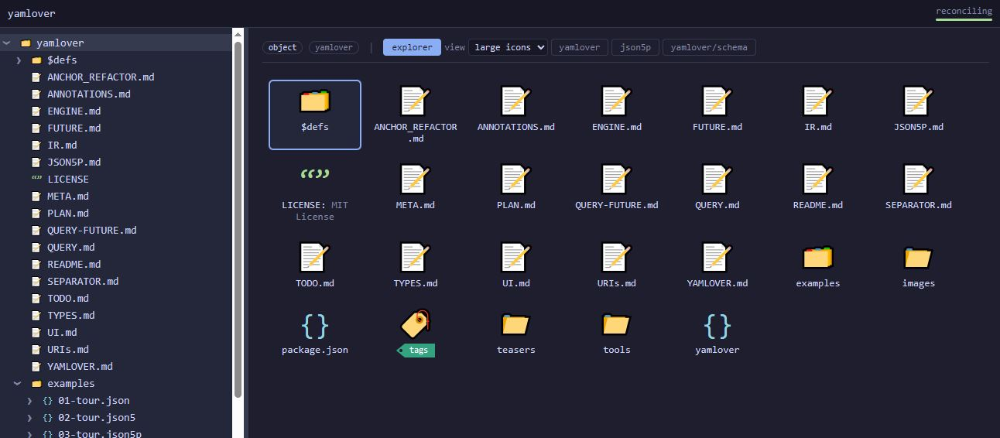
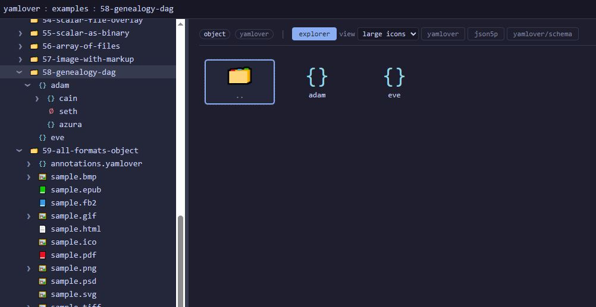
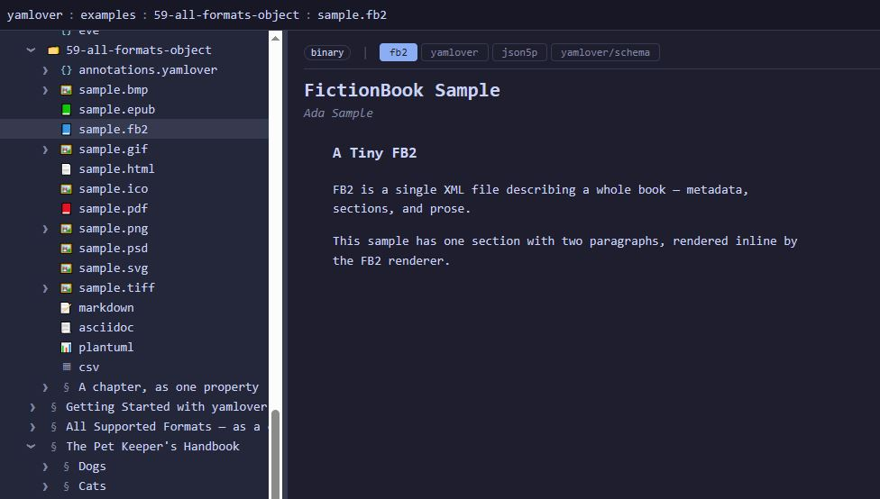
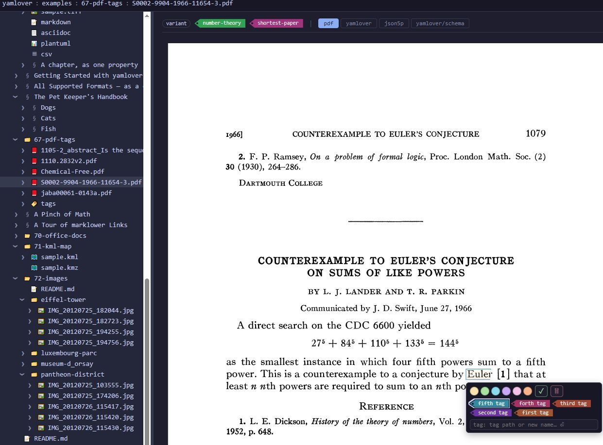
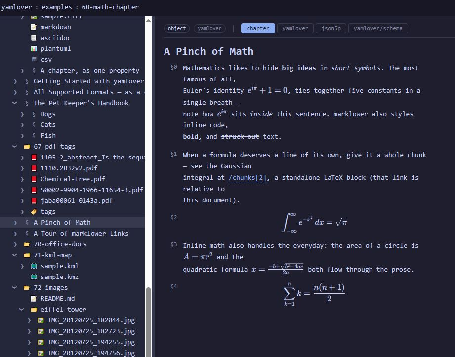
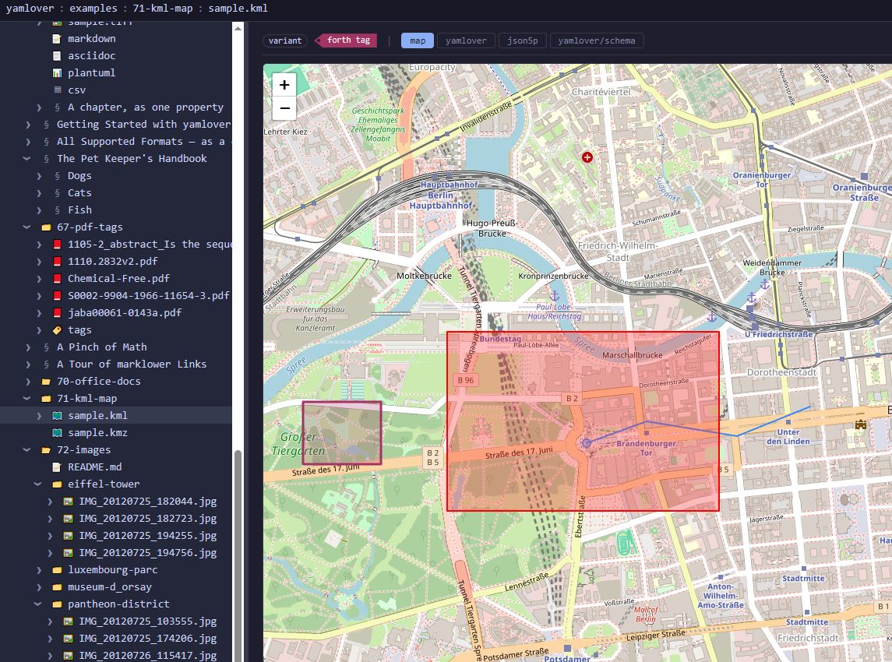
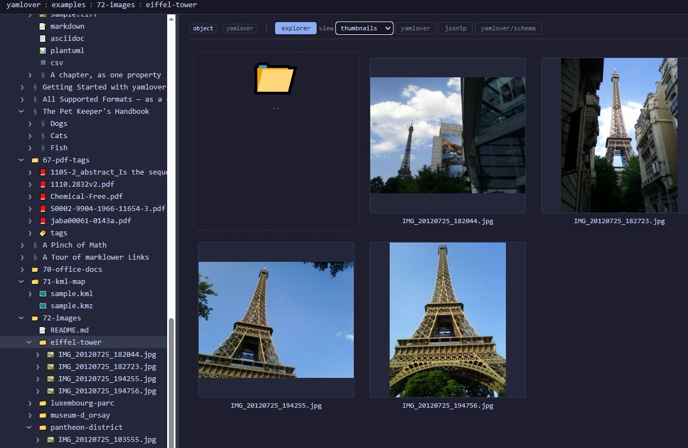
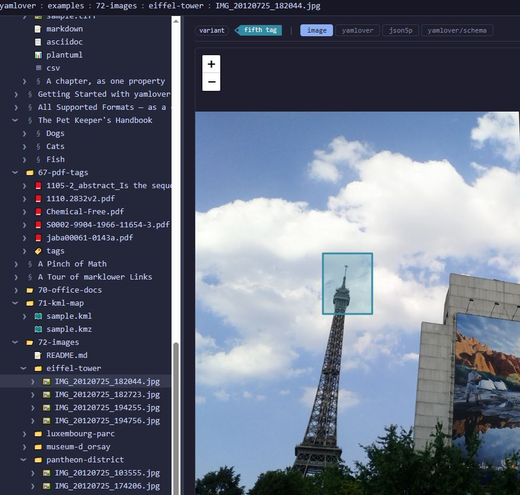

Программа yamlover server (когда она будет закончена) представляет собой

[Скачать отсюда](https://github.com/dims12/yamlover/releases)

- универсальный менеджер файлов (как Total Commander, Directory Opus, XYplorer, Far Manager, Dolphin, Nautilus)
- менеджер тегов (как TagSpaces, Tabbles, TaggedFrog, hydrus)
- менеджер фотографий и галерея (как XnView, ACDSee, digiKam, Adobe Lightroom, Apple/Google Photos)
- блокнот и органайзер (как OneNote, Evernote, Obsidian, Notion, Logseq, Joplin)
- база знаний и личная вики *(планируется)* (как TiddlyWiki, DokuWiki, DEVONthink, Roam Research)
- иерархический редактор-структуратор / outliner *(планируется)* (как Workflowy, Dynalist, org-mode)
- редактор интеллект-карт *(планируется)* (как XMind, FreeMind, Freeplane, MindManager)
- менеджер ссылок и библиографии *(планируется)* (как Zotero, Mendeley, EndNote, JabRef)
- менеджер документов и электронной библиотеки *(планируется)* (как Calibre, DEVONthink)
- редактор генеалогии *(планируется)* (как Gramps, Family Tree Maker, MyHeritage, Ahnenblatt)
- редактор структурированных данных YAML/JSON (как Dadroit, онлайн JSON-редакторы, табличные БД)
- среда для управления агентами-LLM *(планируется)* (как рабочие пространства Cursor, Obsidian + плагины)

При этом всё это — над **обычными файлами и папками**, в открытом человекочитаемом
формате, без проприетарной базы и без привязки к одному вендору. Данные остаются
вашими: их видно в файловом менеджере, их можно положить в git, синхронизировать
любым облаком и читать без самой программы.

## Несколько экранов

## Честное сравнение

Знаком ✓ отмечено «есть и хорошо», ◐ — «частично / не родное», ✗ — «нет»,
а **план** — «заложено в проект, но ещё не готово». yamlover пока в стадии
альфы, поэтому в его колонке честно стоит много «план».

| Возможность | yamlover | Obsidian | Notion | XnView/digiKam | Zotero | Total Commander |
|---|:---:|:---:|:---:|:---:|:---:|:---:|
| Хранение в обычных файлах/папках | ✓ | ✓ | ✗ | ✓ | ◐ | ✓ |
| Открытый человекочитаемый формат | ✓ | ◐ (Markdown) | ✗ | ✗ | ◐ | — |
| Нет привязки к вендору / локальное | ✓ | ✓ | ✗ | ✓ | ◐ | ✓ |
| Дружит с git / версионирование | ✓ | ◐ | ✗ | ✗ | ✗ | — |
| Управление файлами | ◐ | ◐ | ✗ | ◐ | ✗ | ✓ |
| Теги | ◐ | ◐ | ◐ | ✓ | ✓ | ✗ |
| Связи / граф / DAG (указатели) | ◐ | ◐ (ссылки) | ◐ | ✗ | ✗ | ✗ |
| Просмотр фото и галерея | ◐ | ✗ | ✗ | ✓ | ✗ | ◐ |
| Заметки и документы | ◐ | ✓ | ✓ | ✗ | ◐ | ✗ |
| Интеллект-карты | план | ◐ (плагин) | ✗ | ✗ | ✗ | ✗ |
| Библиография / цитирование | план | ◐ (плагин) | ✗ | ✗ | ✓ | ✗ |
| Генеалогия | план | ✗ | ✗ | ✗ | ✗ | ✗ |
| Структурированные данные YAML/JSON | ◐ | ◐ | ◐ | ✗ | ✗ | ✗ |
| Веб-интерфейс / кроссплатформенность | ✓ | ✓ | ✓ | ◐ | ✓ | ✗ (Windows) |
| Зрелость / готовность сегодня | ◐ альфа | ✓ | ✓ | ✓ | ✓ | ✓ |

**Где yamlover уже силён:** одна модель для файлов, тегов, заметок и связей
поверх вашей файловой системы, всё в открытом формате и под контролем git.

**Где он пока уступает:** каждый из конкурентов годами оттачивал свою узкую нишу —
XnView быстрее покажет 50 000 фотографий, Zotero лучше знает форматы цитирования,
Obsidian богаче плагинами. yamlover не пытается обогнать их по отдельности; его идея
в том, чтобы не разносить одну и ту же коллекцию по шести разным программам с шестью
разными базами.
